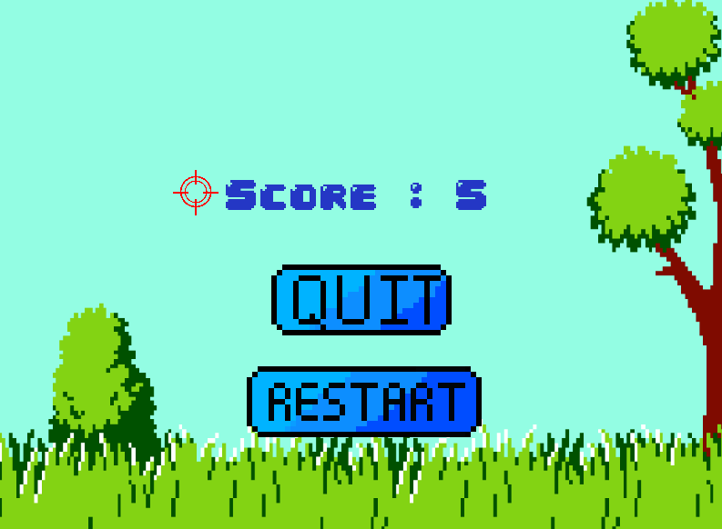

# MY_HUNTER
The My_hunter is a C graphics project that was done solo over a three week period. 
The goal is to recreate a "duck hunt" in C with the SFML library. 

---
## Installation and usage

To use it, follow the instructions below: 
- Clone the repository by entering the following command in your terminal:

        git clone git@github.com:nathanbaudelin/My_hunter.git

- Extract the CSFML library (CSFML-2.5-sources.zip).

- Once inside the cloned folder, compile the project by entering the command:

        make re

- Run the program by entering these commands:

    - In order to open the helper of the game, you need to run the program with this command:

            ./my_hunter -h

    - In order to play game, you need to run the program with this command:

            ./my_hunter

## Picture of the game

